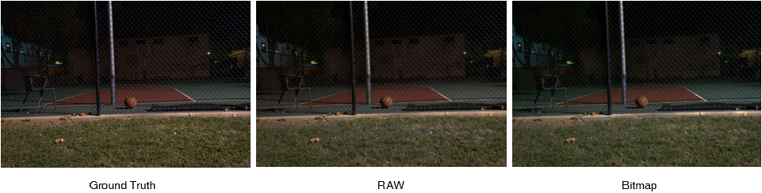

# Low-light Bitmap Enhancement

It's a method can do low-light image processing on ordinary bitmap (png / jpeg / tiff / ...). It also uses See-in-the-Dark (SID) dataset.

For better distinction, it can also be called Easy-to-See-in-the-Dark.

## Setup

It uses the same dataset as [Learning-to-See-in-the-Dark](https://github.com/cchen156/Learning-to-See-in-the-Dark), but you need to convert raw image to tiff (16-bit per channel).

Use the following command to download the dataset or trained model and follow the prompts to select the downloaded content:

```
python utils/download.py
```

Also you can download directly from Google Drive:

- Model: [Data](https://drive.google.com/file/d/1xdw4oJbrfeV5U6YZMDCIXJxjIIa8fOhE/view?usp=sharing) and [Meta](https://drive.google.com/file/d/1Pv0y04lDO0CfhGVQ6IbeeMZFysF7QRGU/view?usp=sharing)
- Dataset: [Sony](https://drive.google.com/file/d/10kpAcvldtcb9G2ze5hTcF1odzu4V_Zvh/view?usp=sharing)

Use the command to convert raw image to tiff image easily:

```
python utils/raw2tiff.py
```

Confirm the data structure is as follows:

```
~/
  dataset/
    long/
      .../
    short/
      .../
    ...
  checkpoint/
    model.ckpt.data-00000-of-00001
    model.ckpt.meta
    ...
  ...
```

**The origin Sony dataset won't be used, you can delete it manually.**

## Start

Use the following command to train the model:

```
python train.py
```

*Training allocated large memory (Maybe 64GB), but you can modify the method to load dataset.*

Use the following commands to test:

```
python test.py
```

*Test allocated large GPU's memory, if your GPU is not powerful enough, you can run it on CPU.*

Simplify test can do as follow (No need to download dataset):

```
python simple.py
```

## Result


